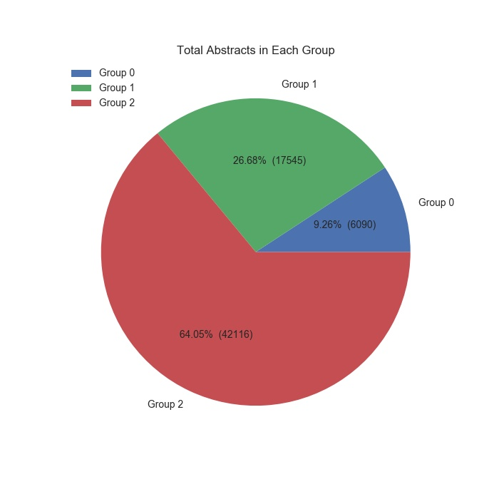
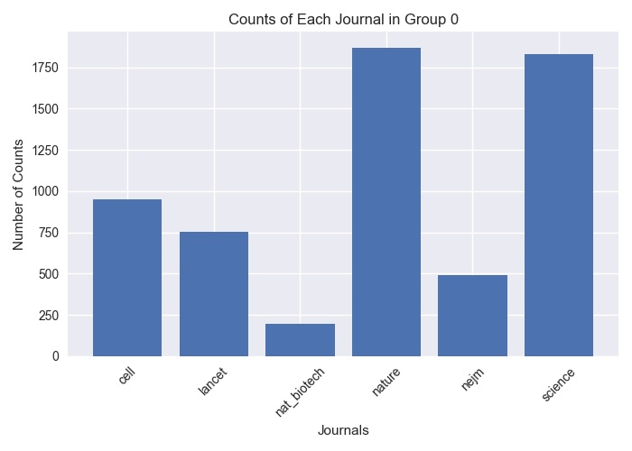
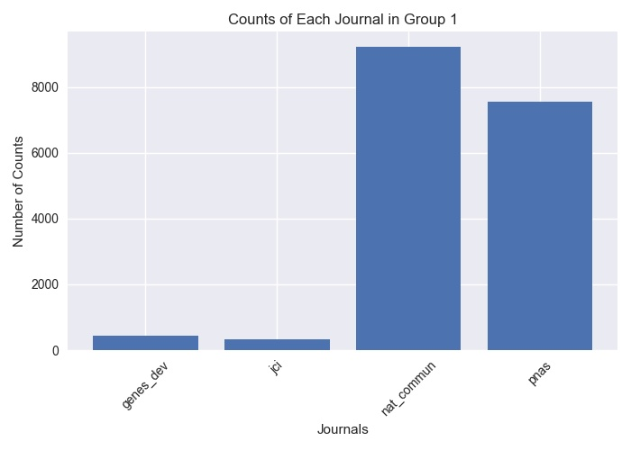
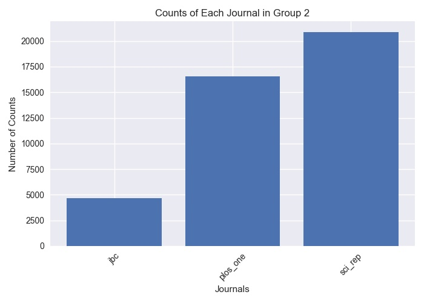

## **Predict Research Significance Based on Its Abstract**

#### A. Data Collection  
Raw data were fetched from [Pubmed](https://www.ncbi.nlm.nih.gov/pubmed/) in Medline format with different start date, and were divided into three groups:  
  * **Group 0** includes publications from **6** journals:  
  Nature (from: 2016-01-01), Science (from: 2016-01-01), Cell (from: 2016-01-01), New England Journal of Medicine (nejm) (from: 2016-01-01), Nature Biotechnology (nat_biotechnol) (from: 2016-01-01), Lancet (from: 2016-01-01). 

* **Group 1** includes publications from **4** journals:  
The Journal of Clinical Investigation (jci) (from: 2016-01-01), Genes & Development (gens_dev) (from: 2016-01-01), Proceedings of the National Academy of Sciences of the United States of America (pnas) (from: 2016-01-01), Nature Communications (nat_comm) (from: 2016-01-01). 

* **Group 2** includes publications from **3** journals:  
Journal of Biological Chemistry (jbc) (from: 2016-01-01), Scientific Reports (sci_rep) (from: 2017-06-01), Plos One (from: 2017-06-01). 

#### B. Data Munging
* Downloaded medline formatted data from each journal were converted to pandas dataframe type with columns: **'PMID', 'Title', 'Abstract'** and **'Journal'**. Detailed code could be found in ***format_convert.py***. 

* All converted data in the same group were combined into one single dataframe. Records with incorrect data in **'Abstract'** column were removed. Detailed code could be found in ***data_combine.py*** 

* Summary of the cleaned data were shown below: 
    * Total data in all groups: 
     
    * Counts in individual groups: 
    
    
     

#### C. Feature Engineering
* Data split: 
 1. Data in each group were randomly shuffled by rows;
 2. 20% of data were used as test data, and 80% of data were used as training data. 

* Nature language processing: 
 1. Each word in abstract was lemmatized and lower cased;
 2. None English words and stop words were removed;
 3. Customized stop words were removed.    

* Data combination: 
    Cleaned abstracts in all groups were combined into single csv file (**x_train.csv** & **x_test.csv**). And their corresponding labels were also combined into single csv file with same order (**y_train.csv** & **y_test.csv**).    

* Detailed code could be found in ***data_clean.py***

#### D. Model Training
* Word to vector: 
Abstracts were converted to sparse matrix by using TF-IDF method.

* Scaling: 
MaxAbsScaler was used to scale the features.

* Model Training: 
Due to the limited computation power, logistic regression model was used for this project. Various parameters were tested and recorded in ***logistic_regression_params.csv***. The confusion matrix of the best model could be found in ***logreg_cm.csv***. Detailed code could be found in ***logreg_params_search.py*** and ***model_training.py***.

* A sample model was demonstrated here: 
[https://if-pred.herokuapp.com](https://if-pred.herokuapp.com)
